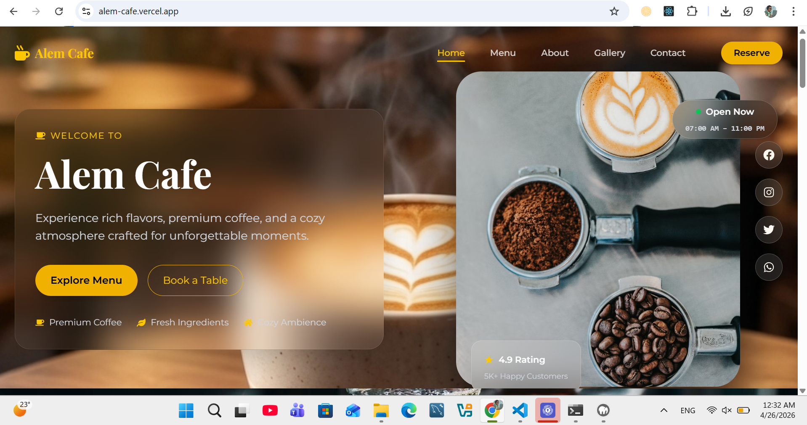
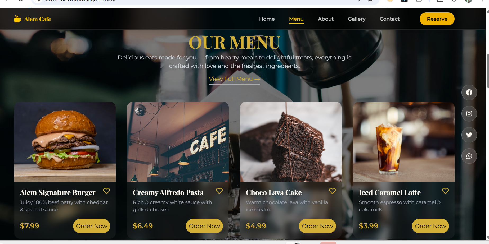
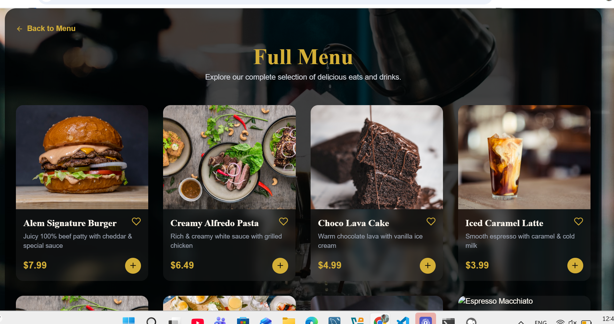
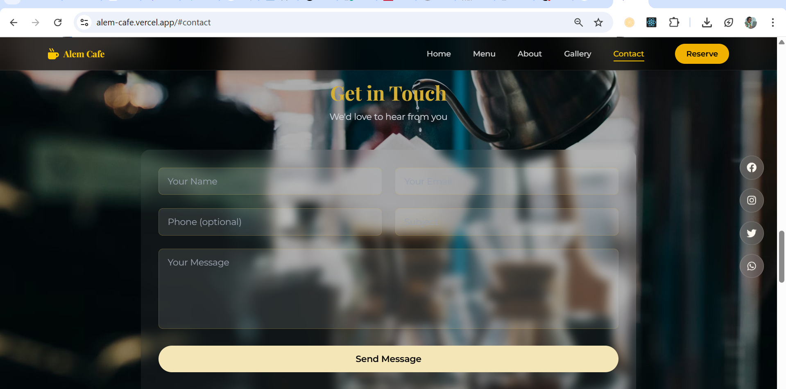
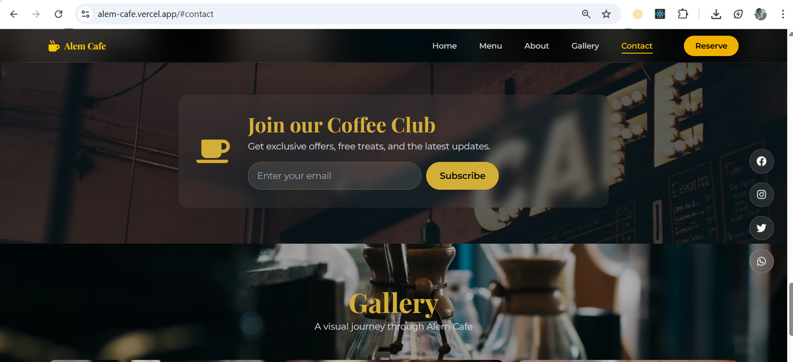

# ☕ Alem Cafe – Modern Local Business Website

A fully responsive, full‑stack website for **Alem Cafe** – a premium coffee shop in Addis Ababa.  
Built as Task 3 for the **Future Interns Full Stack Web Development internship**.

🔗 **Live Demo:** [https://alem-cafe.vercel.app](https://alem-cafe.vercel.app)  
📁 **GitHub Repository:** [https://github.com/ame12-max/FUTURE_FS_03](https://github.com/ame12-max/FUTURE_FS_03)

---

## 📸 Screenshots

*Add actual screenshots inside the `screenshots/` folder and replace the placeholders.*

| Hero Section | Menu Section | Full Menu Page |
|--------------|--------------|----------------|
|  |  |  |

| Contact Form | Newsletter | Reservation Modal |
|--------------|------------|-------------------|
|  |  |  |

---

## ✨ Features

- **Modern, glassmorphic UI** – dark theme with gold accents, subtle blur effects.
- **Fully responsive** – works flawlessly on mobile, tablet, and desktop (tested down to 280px).
- **Dynamic menu system** – menu items stored centrally; homepage shows 4 featured items, detailed page shows full data.
- **Like persistence** – liked items are saved in `localStorage` (no backend required).
- **Order demo** – “Buy Now” button (alert only – no real payment, as per task).
- **Contact form** – sends messages to backend (saved in MySQL, optional email).
- **Newsletter subscription** – collects emails with duplicate prevention.
- **Table reservation** – stores bookings in database (date, time, guests, special requests).
- **Google Maps integration** – embedded location map.
- **WhatsApp chat link** – direct chat button.
- **Smooth animations** – scroll-triggered fades and hover effects using Framer Motion.
- **SEO‑friendly** – semantic HTML, meta tags (optional).

---

## 🛠️ Tech Stack

### Frontend
- React 18 + Vite
- Tailwind CSS v4 (with `@tailwindcss/vite`)
- Framer Motion
- React Router DOM
- Axios
- React Icons

### Backend (optional, for dynamic features)
- Node.js + Express
- MySQL (with `mysql2`)
- Resend (email) – optional
- JWT (optional for admin)

---

## 📁 Folder Structure
FUTURE_FS_03/
├── alem-cafe-backend/ # Backend (Node/Express)
│ ├── config/ # DB connection
│ ├── controllers/ # API logic
│ ├── models/ # DB models
│ ├── routes/ # API endpoints
│ ├── utils/ # Email service
│ ├── .env
│ └── server.js
├── src/ # Frontend (React)
│ ├── assets/ # Images, logo
│ ├── components/ # Reusable UI components
│ ├── data/ # Shared menuItems.js
│ ├── pages/ # Home, MenuDetail, FullMenu
│ ├── App.jsx
│ ├── main.jsx
│ └── index.css
├── screenshots/ # Add your images here
├── .env # Frontend environment
├── package.json
├── README.md
└── PITCH.md # Business pitch (see below)

text

---

## 🔧 Installation & Setup

### Prerequisites
- Node.js (v18+)
- MySQL (optional – for backend)
- npm or yarn

### 1. Clone the repository

```bash
git clone https://github.com/ame12-max/FUTURE_FS_03.git
cd FUTURE_FS_03
2. Frontend Setup
bash
npm install
Create a .env file in the root:

env
VITE_API_BASE_URL=http://localhost:5000   # or your deployed backend URL
Run the development server:

bash
npm run dev
3. Backend Setup (optional – for dynamic features)
bash
cd alem-cafe-backend
npm install
Create a .env file inside alem-cafe-backend:

env
PORT=5000
DB_HOST=localhost
DB_USER=root
DB_PASSWORD=yourpassword
DB_NAME=alem_cafe_db
RESEND_API_KEY=re_xxxxxx        # optional, for email
EMAIL_FROM=onboarding@resend.dev
ADMIN_EMAIL=admin@example.com
Set up the database (run the SQL from the database.sql file – you can create it from the schema provided in the code comments).

Start the backend:

bash
node server.js
Now the full‑stack application is ready.

📡 API Endpoints
Method	Endpoint	Description
POST	/api/contact	Send contact message
POST	/api/newsletter	Subscribe email
POST	/api/reservations	Create a table reservation
All endpoints return JSON and are integrated with the frontend forms.

🚀 Deployment
Frontend (Vercel / Netlify)
Build: npm run build

Deploy the dist folder.

Set VITE_API_BASE_URL to your live backend URL.

Backend (Render / Railway)
Push the alem-cafe-backend folder to GitHub.

Connect the repository on Render.

Add all environment variables.

Use a cloud MySQL database (e.g., Aiven, ClearDB).

📄 Pitch (Business Value)
See PITCH.md for the full business explanation.

In short: Alem Cafe previously had no online presence. This website provides:

A 24/7 digital storefront showcasing menu, location, and hours.

Direct customer engagement (contact form, WhatsApp, newsletter).

Reservation system to manage table bookings.

A modern, trustworthy brand image that attracts more customers.

👨‍💻 Author
Amare – GitHub | LinkedIn
